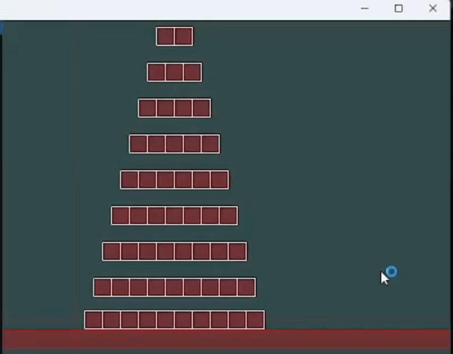
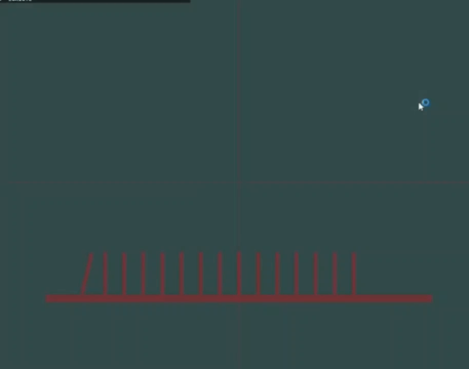
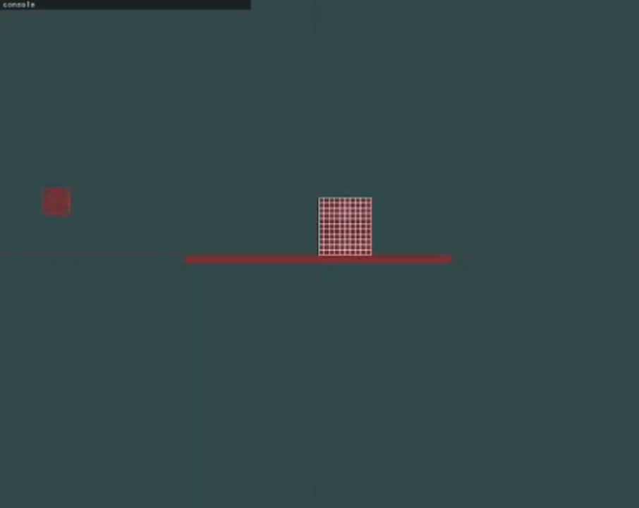

# PhysicsEngine2D| 物理引擎

## 介绍

这是一个用C++写的简单的刚体物理引擎，本项目是一个Visual Studio项目请使用Visual Studio打开sln文件。

## 功能  

- 使用OpenGL渲染基本几何图形以及所有的场景
- 使用imgui作为程序的GUI界面

- 实现了基本几何图形之间模拟
  - 多边形与多边形
  - 多边形与圆形
  - 圆形与圆形
- 使用AABB包围盒技术优化碰撞检测速度（Broad Phase）
- 实现了基本几何图形之间的碰撞检测（SAT算法Narrow Phase）  
- 实现了基于冲量的碰撞后的动力学解算
  - 速度
  - 反冲力
  - 摩擦冲量
  - 角动量 

## 开始

本项目是一个本项目是一个Visual Studio项目请使用Visual Studio打开sln文件。

## 演示

## 遗憾

1. 由于这个项目也是出于学习的目的，学习的知识不够，框架设计也有问题，导致接入约束求解器有点困难，留给变强以后的自己实现吧。
2. 由于此时对OpenGL了解的不多，C++也学的不精，所以不会批量绘制图形，优化算法/代码，可能是导致程序程序帧率下降的原因，解决方法帧率下降的方法除了上述问题，还有一些专门的碰撞检测优化算法等等。

